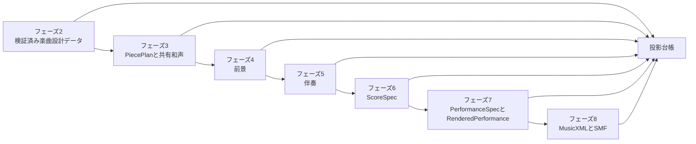

# ピアノ向け楽譜・演奏生成の全体像

この文書は、`solo_piano_3m_v2`が[楽曲設計データ](glossary.md#楽曲設計データ)をピアノの楽譜と演奏へ変換する経路を示す入口である。各データの意味は[用語集](glossary.md)、詳しい契約は専用文書を正本とする。実装の未完了箇所は[roadmap](../roadmap/scoim-next-generation-path.md)に記載する。

## 生成順

フェーズ3で`PiecePlan`を確定し、後続の和声、前景、伴奏が同じ楽譜生成単位と時間容量を使うようにする。フェーズ6で`ScoreSpec`と診断用SMFを完成させる。フェーズ7は、楽譜を変えない自然言語の演奏指示、完成した楽譜、生成プロファイルの演奏要素と演奏選択語彙から`PerformanceSpec`と`RenderedPerformance`を作る。フェーズ8はMusicXMLとSMFを生成して再読込みする。正確な呼び出し順と失敗分岐は[生成工程](scoim-generation-workflow.md)を正本とする。

新しい経路では、`scoim.performance_ir.PerformanceSpec`を演奏指定の正本型とする。旧`v1`の同名型へ変換してフェーズ7の検査を行わない。`ScoreSpec`からMusicXMLを、`RenderedPerformance`からSMFを作る。実装でまだ接続されていない処理は[roadmap](../roadmap/scoim-next-generation-path.md)に記載する。

子区分を持たない一つの区分は一つの楽譜生成単位へ対応する。同じ区分のマテリアル配置は、それぞれ別の楽譜生成単位レイヤーとなり、時間の基準と和声を共有する。各レイヤーの音符は、区分内の異なる位置で始まり、終わってよい。一つのレイヤーは上下両方の声部を含められる。演奏音符は元の楽譜音符を参照し、そこから楽譜生成単位レイヤーをたどる。投影台帳が各段階の対応を検査する。

## 専用文書

- [楽曲設計データ](scoim-script.md): 区分、マテリアル、マテリアル配置、投影台帳
- [ピアノ楽譜](solo-piano-score.md): `PiecePlan`、`ScoreSpec`、楽譜生成単位、楽譜生成単位レイヤー、MusicXML
- [ピアノ演奏](solo-piano-performance.md): `PerformanceSpec`、時間、強弱、アーティキュレーション、ペダル、SMF
- [ピアノ生成ランタイム](solo-piano-generation-runtime.md): LLM呼び出し、作成途中状態、検査、保存、再開、互換性
- [3分ピアノ生成プロファイル](controllable-composition-system.md): `v1`と`v2`の境界、初版の能力、成功条件
