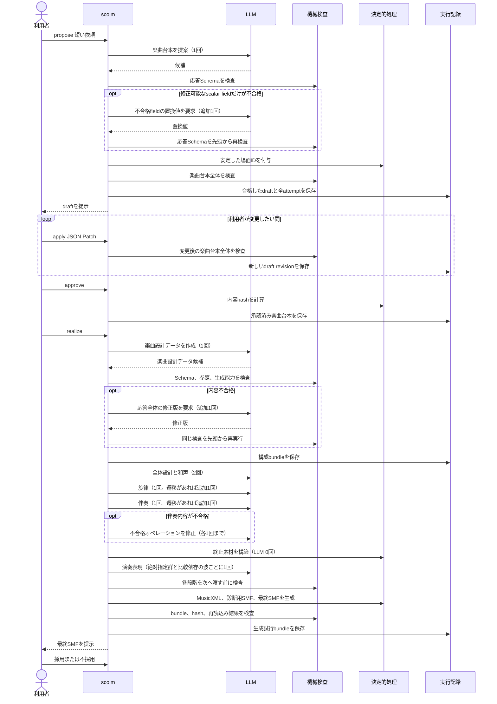

# SCoIM生成工程

この文書は、SCoIMが採用する処理順、LLM呼び出し、機械検査、失敗処理を定める。成果物の意味は[用語集](glossary.md)、設計判断の状態は[決定状態](scoim-decision-status.md)を参照する。設計に対する実装の未完了箇所は[roadmap](../roadmap/scoim-next-generation-path.md)に記載する。

公開CLIは、既定の`solo_piano_3m_v2`と、明示指定する互換経路`solo_piano_3m_v1`を扱う。二つの型、bundle、生成処理を相互に読み替えない。生成試行bundleの通信なし再生は、CLIの既定値ではなくmanifestに記録された版へ振り分ける。

## 公開CLIの生成工程

互換経路`solo_piano_3m_v1`は、次の順に処理する。

### 楽曲台本

`propose`は通常1回だけLLMを呼ぶ。最初の応答にある不合格が、値の型、範囲、列挙値、文字列形式など、既存のscalar fieldの置換だけで直せる場合に限り、追加1回の局所修正を行う。構造の追加や削除が必要な場合、通信に失敗した場合、修正後も不合格の場合は失敗終了する。

利用者の修正は`apply`によるJSON Patchで行い、LLMを呼ばない。`apply`は変更後の文書全体を検査する。`approve`は合格したdraftの内容hashを固定する。

### 楽曲設計データ

承認済み楽曲台本から`solo_piano_3m_v1`の楽曲設計データを作る通常呼び出しは1回である。内容不合格の場合は、同じSchemaで応答全体を追加1回だけ作り直す。合格した結果は構成bundleへ保存する。通信失敗は内容修正の対象にしない。

### 5段階の実現

公開`realize`は、検証済み楽曲設計データを次の5段階で実現する。

| 段階 | 通常のLLM呼び出し | 内容修正 |
|---|---:|---:|
| `plan-harmony` | 全体設計1回、和声1回 | なし |
| `melody` | 通常旋律1回、遷移があれば遷移旋律1回 | なし |
| `accompaniment` | 通常伴奏1回、遷移があれば遷移伴奏1回 | 各オペレーション1回まで |
| `ending` | 0回 | なし |
| `performance` | 絶対指定群があれば1回、比較依存の波ごとに1回 | なし |

段階ごとの通常呼び出し数は、楽曲設計データの構造から開始前に決まり、実行記録へ保存する。一つの段階または内容修正が合格しなければ、後続段階を実行しない。検証済みの上流値は書き換えない。

`ending`は現在、Pythonが終止用マテリアルを作る段階である。この処理は公開経路の現行挙動として記録するが、新しい`v2`経路へは引き継がない。

## `solo_piano_3m_v2`の公開生成工程

`solo_piano_3m_v2`は公開CLIの既定生成経路として、次の順に処理する。

```mermaid
sequenceDiagram
    actor User as 利用者
    participant App as scoim realize
    participant Profile as 生成プロファイル
    participant LLM
    participant Python as 決定的処理
    participant Check as 機械検査
    participant State as 作成途中状態と実行記録

    User->>App: 承認済み楽曲台本またはv2構成bundleから開始
    App->>Check: 入力の種類、版、内容hashを検査
    alt 新しいOUTPUT
        App->>Python: public-run.jsonを一時directoryへ作成
        App->>Check: 入力、profile、ID、モデル実行条件を検査
        App->>State: public-run.jsonとOUTPUTを一体で確定
    else 既存OUTPUT
        App->>Check: public-run.jsonと今回の要求を照合
        break 要求不一致、改変、終了状態不明
            App->>State: 型付き理由を返して終了
        end
        App->>State: 検証済みの完成工程を再利用
    end
    App->>Check: モデル実行条件を事前照合（LLM 0回）
    Note over App,Check: 以降の各LLM応答でもrunnerが記録した情報を照合する

    Note over App,State: フェーズ2 楽曲設計データ
    alt 入力が承認済み楽曲台本
        App->>LLM: フェーズ2-1 構造、再利用、遷移専用区分を提案
        LLM-->>App: IDを持たない構造候補、区分用途、runnerが記録した情報
        App->>Check: モデル実行条件、候補を検査
        opt 内容不合格かつ修正可能
            App->>LLM: 問題と変更禁止値を渡して修正（追加1回まで）
            LLM-->>App: 構造候補の修正版とrunnerが記録した情報
            App->>Check: モデル実行条件、同じ検査を先頭から再実行
        end
        break 検査不合格が残る
            App->>State: 失敗理由と全attemptを保存して終了
        end
        App->>Python: 安定IDを付与し、能力と遷移専用区分を検査
        App->>Python: 遷移専用区分ごとに有効な遷移候補を列挙
        App->>Profile: 対応する演奏要素と説明を取得
        Profile-->>App: 演奏要素のIDと平易な説明
        App->>LLM: フェーズ2-2 変奏、遷移候補の選択、演奏指示を提案
        LLM-->>App: 候補IDを参照する関係候補とrunnerが記録した情報
        App->>Check: モデル実行条件、候補、完成文書を検査
        App->>Check: フェーズ4・5の変奏・遷移オペレーションを事前検査
        opt 内容不合格かつ修正可能
            App->>LLM: 全問題と変更禁止値を渡して修正（追加1回まで）
            LLM-->>App: 関係候補の修正版とrunnerが記録した情報
            App->>Check: モデル実行条件、事前検査を含む同じ検査を先頭から再実行
        end
        break 検査不合格またはstructure_insufficient
            App->>State: 失敗理由と全attemptを保存して終了
        end
        App->>State: 楽曲設計データと投影台帳を保存
        App->>Check: v2構成bundleを通信なしで検査
        App->>State: 構成bundleを確定
    else 入力がv2構成bundle
        App->>Check: manifest、全ファイル、来歴を検査
    end

    Note over App,State: フェーズ3 PiecePlanと共有和声
    loop フェーズ3の事前登録オペレーション
        App->>LLM: 全体設計または楽譜生成単位の共有和声
        LLM-->>App: 候補
        App->>Check: 候補を検査
        opt 内容不合格かつ修正可能
            App->>LLM: 現在の問題だけを修正（追加1回まで）
            LLM-->>App: 候補の修正版
            App->>Check: 同じ検査を先頭から再実行
        end
        break 検査不合格が残る
            App->>State: 失敗理由と全attemptを保存して終了
        end
        App->>State: 応答hash、検査結果、採用attempt、合格した値を保存
    end

    Note over App,State: フェーズ4 前景
    loop フェーズ4の事前登録オペレーション
        App->>LLM: 前景または遷移前景
        LLM-->>App: 候補
        App->>Check: 候補を検査
        opt 内容不合格かつ修正可能
            App->>LLM: 現在の問題だけを修正（追加1回まで）
            LLM-->>App: 候補の修正版
            App->>Check: 同じ検査を先頭から再実行
        end
        break 検査不合格が残る
            App->>State: 失敗理由と全attemptを保存して終了
        end
        App->>State: 応答hash、検査結果、採用attempt、合格した値を保存
    end

    Note over App,State: フェーズ5 伴奏
    loop フェーズ5の事前登録オペレーション
        App->>LLM: 伴奏または遷移伴奏
        LLM-->>App: 候補
        App->>Python: 希望音域を優先してMIDI音高を配置
        App->>Check: 配置後の候補を検査
        opt 内容不合格かつ修正可能
            App->>LLM: 現在の問題だけを修正（追加1回まで）
            LLM-->>App: 候補の修正版
            App->>Python: 希望音域を優先してMIDI音高を再配置
            App->>Check: 同じ検査を先頭から再実行
        end
        break 検査不合格が残る
            App->>State: 失敗理由と全attemptを保存して終了
        end
        App->>State: 応答hash、検査結果、採用attempt、合格した値を保存
    end

    Note over App,State: フェーズ6 ScoreSpec
    App->>Python: フェーズ6 ScoreSpecを構築
    Python-->>App: ScoreSpecと投影証拠
    App->>Check: 楽譜、来歴、保存物を検査
    break 検査不合格
        App->>State: 失敗理由を保存して終了
    end
    App->>State: 合格したフェーズ6状態を保存

    Note over App,State: フェーズ7 PerformanceSpecとRenderedPerformance
    App->>Profile: 演奏要素と演奏選択語彙を取得
    Profile-->>App: 要素別の版付き選択肢と説明
    App->>Python: 演奏指示の対象と比較元からオペレーション順を固定
    loop フェーズ7の事前登録オペレーション
        App->>LLM: 指示、演奏要素、ScoreSpec、比較元、要素別選択肢を渡す
        LLM-->>App: 有限語彙による演奏方法と未対応指示
        App->>Check: Schema、語彙、演奏要素、対象、対応能力を検査
        opt 内容不合格かつ修正可能
            App->>LLM: 現在の問題だけを修正（追加1回まで）
            LLM-->>App: 演奏方法の修正版
            App->>Check: 同じ検査を先頭から再実行
        end
        break 検査不合格が残る
            App->>State: 失敗理由と全attemptを保存して終了
        end
        App->>Python: IDを対応付けてSectionPerformanceへ変換
        App->>State: 応答hash、検査結果、採用attempt、合格した値と未確認の創作目標を保存
    end
    App->>Python: v2 PerformanceSpecを構築して演奏へ変換
    Python-->>App: PerformanceSpecとRenderedPerformance
    App->>Check: 値域、安全、来歴、決定性を検査
    break 検査不合格
        App->>State: 失敗理由を保存して終了
    end
    App->>State: 合格したフェーズ7状態を保存

    Note over App,State: フェーズ8 最終成果物
    App->>Python: 元の構成manifestとそのhashを複写
    App->>Python: MusicXMLとSMFを生成
    Python-->>App: 楽譜と演奏SMF
    App->>Check: 再読込み、構成manifest hash、必須ファイルを検査
    break 検査不合格
        App->>State: 失敗理由を保存して終了
    end
    App->>State: 検査済みbundleを確定
    App-->>User: 最終SMFを提示
    User->>App: 採用または不採用
```

### フェーズ2

通常のLLM呼び出しは2回である。1回目は区分、マテリアル、マテリアル配置の役割、再利用、遷移専用区分を提案する。区分の自由記述`role`とは別に、非公開転送fieldの`structural_purpose`へ`regular`または`transition_connector`を返す。枝区分は`regular`とし、`transition_connector`は、正の相対長を持つ子区分を持たない区分で、全配置として前景のマテリアル配置を一つだけ持つ場合に限る。

Pythonは安定IDを付け、遷移専用区分の前後で最も近い通常区分の前景配置から、有効な元、遷移専用、先の候補を安定順で列挙する。同じ距離に複数の前景配置がある場合は、すべての組合せを候補にする。前後のどちらかに前景配置がなければ、1回目の内容不合格として2回目へ進まない。区分用途は非公開の作成途中情報であり、公開楽曲設計データへ保存しない。

生成プロファイルから対応する演奏要素と平易な説明を取得したあと、2回目は変奏、遷移、自然言語の演奏指示を提案する。遷移は、遷移専用区分ごとにPythonが作った候補から一つを選び、任意の三つのマテリアル配置IDを返さない。遷移専用区分がない場合だけ、遷移候補の選択を空にできる。遷移専用配置は明示的な変奏関係の元または先にしない。演奏指示には対象、説明、一つ以上の演奏要素、必要な場合は比較元を含めるが、知覚上の特徴名や検査式へ変換しない。各応答は内容不合格の場合に追加1回まで修正でき、最大4回呼ぶ。

演奏指示は、楽譜を変えずに調整できる弾き方だけを扱う。音域、旋律、伴奏音、和音に関する要望は、区分とマテリアルの説明からフェーズ3から5へ渡し、演奏指示へ複写しない。Pythonは演奏要素が生成プロファイルの対応範囲内であることを検査する。自由記述の意味が正しいかは自動判定せず、実際のモデルを使う最小検証と最終試聴で確かめる。

二つ目の応答は、一つ目で決まった構造と再利用を変更しない。Pythonは候補IDを正式なマテリアル配置遷移へ展開し、遷移専用区分の網羅、重複、変奏との競合を検査する。楽曲台本の`transition_to_next`は聞こえ方を表す文章であり、それだけを理由に正式なマテリアル配置遷移を必須にしない。完成文書を検査するときは、フェーズ4・5が使うものと同じ変奏・遷移オペレーション計画処理を通信なしで実行する。生成プロファイルが扱えない関係は、最初の一件で止めずに全件を`unrepresentable`として返す。内容修正後も同じ事前検査を先頭から行い、問題が残る場合は構成bundleを確定しない。候補選択以外の必要な関係を表せない場合は`structure_insufficient`で失敗終了する。

### フェーズ3から5

Pythonは各フェーズを始める前にオペレーションの対象と順序を固定する。通常は一つのオペレーションにつきLLMを1回呼び、内容不合格の場合に同じオペレーションを追加1回まで修正する。したがって、各フェーズの最大呼び出し数はオペレーション数の2倍である。

- フェーズ3は、全体設計と楽譜生成単位ごとの共有和声を作る。
- フェーズ4は、マテリアル配置ごとの前景と遷移前景を作る。
- フェーズ5は、マテリアル配置ごとの伴奏と遷移伴奏を作る。LLMは各音の発音位置、希望音価、和音度数、希望音域、声部、奏法を選ぶ。Pythonは最初に全音を希望音域内だけで配置する。探索上限へ達する前に配置不能と確認できた場合だけ、和音度数と共有和声に一致するピアノ全域の音高を候補にし、希望音域内を先に評価して具体的なMIDI音高を配置する。和音度数、ピアノ音域、同一鍵重複、低域間隔は、どちらの探索でも変えない。

フェーズ4で同じ楽譜生成単位に採用済みの前景音符がある場合、Pythonはその開始位置、音価、音高、声部を占有区間として初回要求からLLMへ渡す。初回と内容修正で同じ占有区間を固定し、候補音符のindex、候補区間、衝突した占有区間を検査結果へ含める。同じ音高かつ同じ声部の半開区間が重なる場合だけを衝突とし、区間の境界が接するだけの場合、異なる音高、異なる声部の同時発音は許す。LLMが音楽上の代案を選び、Pythonは検査合格のために候補音符を自動移調、移動、短縮しない。

各候補は作成途中状態へ適用する前に検査する。不合格になった時点で残りのオペレーションと後続フェーズを実行しない。

### フェーズ6

LLMは呼ばない。フェーズ3から5で検証済みとなった`PiecePlan`、共有和声、前景、伴奏から、Pythonが`ScoreSpec`と追加の投影証拠を構築する。音符を追加、削除、変更しない。中立演奏の診断用SMFを生成して再読込みし、保存済み状態を別プロセスと同じ経路で再構築できた場合だけ完了とする。

### フェーズ7

フェーズ7は、フェーズ6の検査済み`ScoreSpec`と、楽曲設計データの自然言語の演奏指示から、`PerformanceSpec`と`RenderedPerformance`を作る。

Pythonは、生成プロファイルの[演奏要素](glossary.md#演奏要素)と[演奏選択語彙](glossary.md#演奏選択語彙)から応答Schemaと平易な説明を作る。演奏指示の対象と比較元からオペレーション順を固定する。比較元の演奏方法が必要なオペレーションは、その比較元が確定した後に実行する。通常は一つのオペレーションにつきLLMを1回呼び、内容不合格の場合は追加1回まで修正する。

LLMは、自由記述、指示が指定する演奏要素、対象区分の楽譜要約、比較元の確定済み演奏方法、要素別の有限な選択肢から、区分へ適用する演奏方法を選ぶ。指定されていない演奏要素、任意のミリ秒、velocity、ペダル値、未登録の方法、楽譜を変える内容は返さない。Pythonは位置で対象を対応付け、選択fieldが演奏要素の範囲内であることを検査して`SectionPerformance`へ変換する。全オペレーションが合格した後、`scoim.performance_ir.PerformanceSpec`を直接構築し、`RenderedPerformance`へ変換する。

自然言語の演奏指示が意図どおりに聞こえたかは自動判定しない。演奏指示、選択した方法、投影先を保存し、知覚上の達成を`unverified`として投影台帳へ記録する。機械的に確認できないことだけを理由に生成を止めず、未確認の目標を成功済みとも記録しない。

応答の型、登録語彙、参照、生成能力、`PerformanceSpec`の値域、演奏音符と楽譜音符の対応、来歴、決定性に不合格がある場合は、後続へ進まない。未確認の知覚目標は内容不合格や自動フォールバックとして扱わない。

### フェーズ8

フェーズ8はLLMを呼ばない。検査済みの`ScoreSpec`からMusicXMLを、検査済みの`RenderedPerformance`からSMFを生成する。両方を再読込みし、音符、演奏時刻、velocity、ペダル、全体時間、hashを照合する。入力、全attempt、検査結果、投影台帳、最終成果物を一つの生成試行bundleとして確定する。

生成試行bundleは、試行ID、構成ID、元の構成manifestのbytesとそのSHA-256を保存する。生成時には元の構成bundle全体を検査する。通信なし再生時には複写した構成manifestからSHA-256を再計算するが、元の構成bundleが手元にない場合、その全ファイルまで再検証したとは扱わない。

## 共通の検査と失敗処理

LLM応答は、次工程へ渡す前に、読めるJSONか、必要項目と型が正しいか、参照や順序に矛盾がないか、その段階の安全条件を満たすかを検査する。最初に応答Schemaを検査し、不合格ならその応答を参照、順序、安全条件などの内容検査へ渡さない。Schema合格時だけ内容検査を行う。Schema不合格も内容修正へ渡す型付き問題として扱い、修正後はSchema検査からやり直す。

内容修正を行う箇所では、元の依頼、現在分かっている問題、変更してはいけない上流値、元の応答をLLMへ渡す。修正後は、そのオペレーションの検査を先頭から再実行する。修正上限へ達した場合、改善できない場合、修正対象外の場合は、途中結果を完成扱いせず失敗終了する。創作上の目標が意図どおりに聞こえたかを自動判定できないことは、内容不合格に含めない。

Runner不足、認証失敗、timeout、非0終了、応答欠落、quota不足は内容不合格ではない。内容修正を行わず、別の型付き失敗として記録する。公開v2生成では、[モデル実行条件](glossary.md#モデル実行条件)を呼び出し前に固定し、各応答でrunnerが記録した情報と照合する。不一致の応答を採用せず、異なる条件を同じ公開runの続きとして使わない。

## 人間確認

通常の人間確認は、楽曲台本の修正と承認、最終SMFの採用判断の2か所である。内部生成工程が失敗した場合は、内部IDや中間表現の修正を利用者へ求めず、理由と実行記録を残して終了する。

公開`v1`は前景相当と楽譜相当の診断用SMFを生成試行bundleへ保存する。`v2`はフェーズ4と6の実行結果に診断用SMFを保存する。いずれも通常生成を止めず、最終SMFの問題を調べる場合だけ使う。候補順位や後続生成の入力には使わない。フェーズ7で未確認となった創作上の目標は、利用者へ内部データの修正を求めず、最終試聴後の診断へ使える形で生成試行bundleに保存する。

## 記録

モデル要求、モデル応答、応答hash、検査結果、修正要求、修正応答、再検査、採用attemptへの参照、確定結果を上書きせず保存する。採用attemptへの参照は、合格した検査結果と同じ応答を指すことを通信なしで検証する。成功した構成bundleだけが検証済み楽曲設計データを持つ。生成試行bundleは使用した構成manifestのbytesとそのhashを保存する。

正規化、IDと順序の付与、長さ換算、音域配置、hash、保存、MusicXMLとSMFへの変換など、通常経路に含まれる決定的処理はフォールバックとして扱わない。現在の自動フォールバック方針は[決定状態](scoim-decision-status.md)を参照する。
