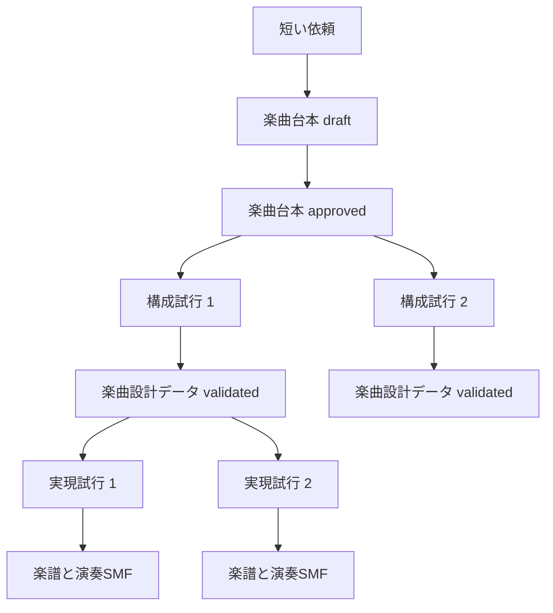

# SCoIMシステム設計

SCoIM（Scripted Co-creation of Impromptu Music、読みは「スコイム」）は、短い作曲依頼から人間とLLMが即興曲を協創するOSSである。人間は音符列より先に楽曲台本を確認し、承認後は機械が楽曲設計データ、楽譜、演奏へ具体化する。初版は約3分の独奏ピアノを対象にするが、中核は特定の楽器やLLMへ固定しない。

## 利用者の流れ

```text
「明るい感じのピアノ曲」のような短い依頼
    ↓
LLMが人間向けの楽曲台本を提案
    ↓
人間が内容を修正して承認
    ↓
機械用の楽曲設計データを作成・検査
    ↓
楽譜と演奏を生成
    ↓
人間が最終SMFを試聴して採用または不採用を判断
```

初版で人間が通常確認するのは、楽曲台本と最終SMFの2か所である。途中データに問題がある場合は、人間へ内部IDやデータ構造の修正を求めず、検査結果を使った有限の内容修正か、理由を明記した失敗終了を行う。

## 正本と派生物



- 短い依頼は提案の入力であり、音楽意図の正本ではない。
- 人間が承認する正本は[楽曲台本](glossary.md#楽曲台本)である。
- 承認済み楽曲台本は不変とし、内容を変える場合は新しいrevisionを作る。
- 承認済み楽曲台本から[楽曲設計データ](glossary.md#楽曲設計データ)を不変な派生物として作る。
- 同じ楽曲台本から設計し直す場合は新しい[構成試行](glossary.md#構成試行)、同じ楽曲設計データから演奏し直す場合は新しい[実現試行](glossary.md#実現試行)にする。
- 下流の失敗や採用結果から、上流の承認済み内容を黙って書き換えない。
- [MusicXML](glossary.md#musicxml)と[SMF](glossary.md#smf)を別々の成果物として扱う。

各成果物の意味は[用語集](glossary.md)、データの詳細は[楽曲台本](scoim-flow.md)と[楽曲設計データ](scoim-script.md)を正本とする。

## 責務

| 構成要素 | 担当すること | 担当しないこと |
|---|---|---|
| SCoIM中核 | 楽曲台本、楽曲設計データ、検査、承認、来歴 | ピアノ固有の音域や奏法 |
| LLMアダプター | 自然言語から音楽上の選択肢を作る | 承認、hash、固定IDの発行 |
| 決定的処理 | Schema、参照、順序、長さ、hash、保存、形式変換 | 複数の妥当な答えから音楽的に選ぶこと |
| 生成プロファイル | 楽曲設計データを特定編成の楽譜と演奏へ投影し、扱える演奏要素と演奏選択語彙を示す | SCoIM中核の語彙を楽器都合で変更すること |
| 実行記録 | すべての要求、応答、検査、成果物、終了状態を保存する | 失敗を成功へ読み替えること |

決定的処理はPythonで実装し、LLMと責務を分ける。詳しい生成順と内容修正は[生成工程](scoim-generation-workflow.md)を正本とし、実装言語と分担に関する設計判断の状態は[決定状態](scoim-decision-status.md)を参照する。

## SCoIM中核と初版実証の境界

SCoIM中核は、楽器に依存しない構成、[マテリアル](glossary.md#マテリアル)、[マテリアル配置](glossary.md#マテリアル配置)、変奏、遷移、[演奏指示](glossary.md#演奏指示)、検査、承認、来歴を扱う。一つの楽曲台本は、一つの[編成](glossary.md#編成)専用とする。

`solo_piano_3m_v2`は、約180秒、一人によるピアノ演奏、複数の楽譜生成単位レイヤー、共有和声、有限な演奏選択語彙を扱う。公開CLIの新規生成ではv2を既定値とし、v1を明示指定する互換経路として残す。ピアノ固有の規則は[3分ピアノ実証](controllable-composition-system.md)以下に置き、中核へ持ち込まない。設計に対する実装の未完了箇所は[roadmap](../roadmap/scoim-next-generation-path.md)に記載する。

## 公開入口

初版は`scoim`というCLIとPythonパッケージ名を使う。利用者向け操作は`propose`、`check`、`show`、`apply`、`approve`、`realize`の6個とし、詳しい契約は[公開インターフェース](scoim-public-interface.md)に置く。内部のフェーズ数やLLM呼び出し単位を公開名へ含めない。

## 失敗の扱い

失敗は、少なくとも次を区別する。

| 分類 | 例 |
|---|---|
| 文書の不正 | 未対応Schema、必須項目不足、参照切れ、循環 |
| 同時更新と保存 | 古いrevision、承認済み文書の上書き、保存先競合 |
| LLM実行 | 実行物不足、非互換、未認証、timeout、応答欠落 |
| 投影 | 現在の下位表現では表せない、選択した生成プロファイルが非対応 |
| 成果物 | 生成後の検査不合格、保存または再読込みの失敗 |

処理できた部分だけを出力して完成扱いにしない。LLMから応答を取得できなかった失敗と、取得した応答内容の不合格は別に記録する。

創作上の目標が意図どおりに聞こえたかを自動判定できないことは、処理失敗とは扱わない。対象の記述を該当段階へ渡し、選択した方法を保存したうえで、知覚上の達成を`unverified`として記録する。形式、安全、来歴、再現性、生成プロファイルの対応能力に不合格がある場合は失敗とする。

## 互換性

公開前の`llm_musical_composer` API、旧`generation_intent`、旧`Composition`との後方互換性は保証しない。既存bundleの通信なし再生に必要な旧Schemaと実現器は維持するが、新しい生成経路へ暗黙に移行しない。初版公開後にSchemaを破壊的に変更する場合は、新しい版と明示的な移行結果を作り、既存の承認済み文書を上書きしない。

## 非ゴール

- 初版と同時にGUI、グラフDB、専用DSLを作ること。
- 全楽器、全ジャンル、任意の尺を初版で扱うこと。
- 同じ楽曲台本から編成だけを差し替えること。
- 参照曲の音符を複製すること。
- 自動指標だけで楽曲の良さを保証すること。
- 下位の楽譜や演奏データを一般利用者へ直接修正させること。

## 設計を見直す条件

- 局所変更のたびに文書全体を作り直さなければならない。
- 下位表現が上位の承認内容を変更しないと成立しない。
- 一つの曲だけを直し続け、構造の異なる例を通せない。
- ピアノ固有の規則をSCoIM中核へ追加しなければ実装できない。
- 人間が通常確認しない内部表現の理解を、利用者へ繰り返し要求する。

設計判断の状態は[決定状態](scoim-decision-status.md)を正本とする。
